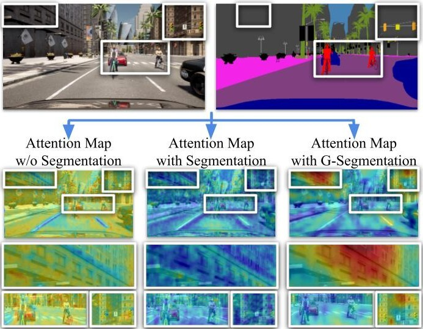
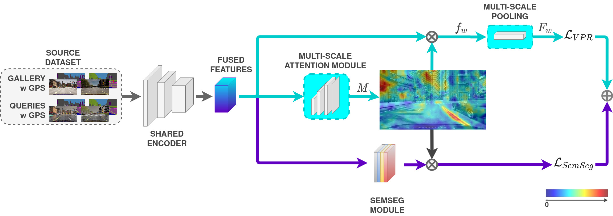
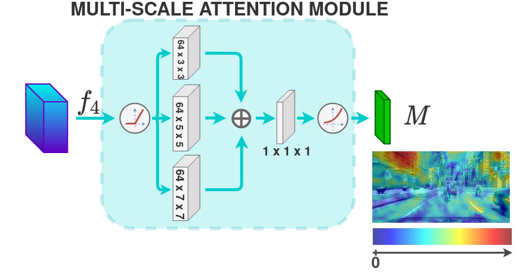
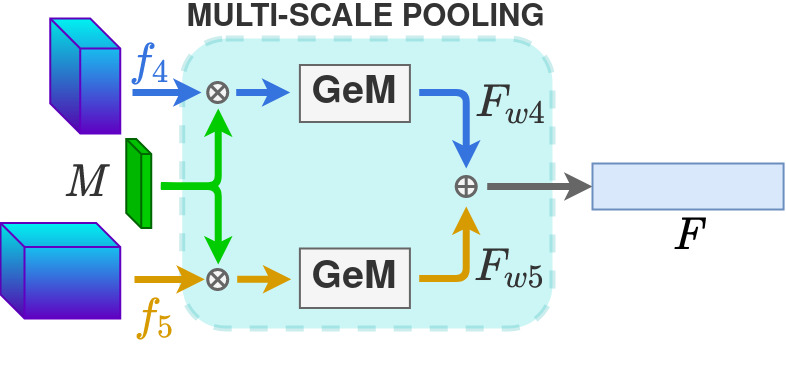

# SegVPR
 in proceedings @ICIAP2022  
<table>
<thead>
  <tr>
    <th>Overview</th>
    <th colspan="2">Architecture</th>
  </tr>
</thead>
<tbody>
  <tr>
    <td rowspan="3"></td>
    <td colspan="2"></td>
  </tr>
  <tr>
    <td rowspan="2"></td>
    <td rowspan="2"></td>
  </tr>
  <tr>
  </tr>
  </tbody>
</table>
  
**Setup:**
 * Install Python3.6+
 * Install pip3
 * `pip install -r `[requirements.txt](./requirements.txt)
  
  
**Datasets: (please refer to [details](./dataset_details.txt))**
 * IDDAv2 dataset is available on demand;
 * Oxford RobotCar available on the official website. We use the Overcast scenario as the gallery, 
   while the queries are divided into four scenarios: Rain, Snow, Sun, and Night, with one image sampled every 5 meters 
   and filename formatted as `@UTMx@UTMy@.jpg`. 
  
  
**Usage:**
 * *Train:* Using default parameters, the script uses the final architecture configuration with 
   ResNet50 encoder, DeepLab semantic segmentation module, multi-scale pooling layer from 4th and 5th conv blocks and 
   finally the domain adaptation module. 
   It follows the exact training protocol and implementation details described into the main paper and supplementary 
   material. It trains all layers of the encoder and uses the multi-scale attention computed with the features
   extracted from the 4th conv block.  
   `python3 main.py --exp_name=<name output log folder> --dataset_root=<root path of IDDAv2 train dataset> 
   --dataset_root_val=<root path of IDDAv2 val dataset> --dataset_root_test=<root path of RobotCar dataset> 
   --DA_datasets=<path to the RobotCar folder where all scenarios are merged>`  
   To resume the training specify `--resume=<path of checkpoint .pth>`  
   To change the encoder specify `--arch=resnet101`  
   To change the semantic segmentation module specify `--semnet=pspnet` 
 * *Evaluate:*   
   `python3 eval.py --resume=<path of checkpoint .pth> --dataset_root_val=<root path of IDDAv2 val dataset> 
   --dataset_root_test=<root path of RobotCar dataset>`
  
  
**Pretrained models:**
 * [ResNet50 + DeepLab](https://drive.google.com/file/d/1Jv0hoarx3tTnL59Phl119FoljkJpu9dP/view?usp=sharing)
 * [ResNet50 + PSPNet](https://drive.google.com/file/d/1g33N0gVNGAKWgx0gHbDcAybVxMUkUtdt/view?usp=sharing)
 * [ResNet101 + DeepLab](https://drive.google.com/file/d/1R6m4FpOrf4oOwVO-TnSGZjtE5tR5LCJd/view?usp=sharing)
 * [ResNet101 + PSPNet](https://drive.google.com/file/d/1uQqr7oDeg5T8JQNxtHtEnkleA2orf2cx/view?usp=sharing)  
*Please note:* the main paper shows average recalls obtained from all configurations run three times with different seeds respectively. 
Here instead we provide only one model per configuration.
  
  
**Citation:**
BibTex: 
@article{Paolicelli_2022_ICIAP,   
author = {Paolicelli, Valerio and Tavera, Antonio and Masone, Carlo and Berton, Gabriele Moreno and Caputo, Barbara},   
title = {Learning Semantics for Visual Place Recognition through Multi-Scale Attention},  
booktitle = {}, month = {March}, year = {2022}, pages = {} }
